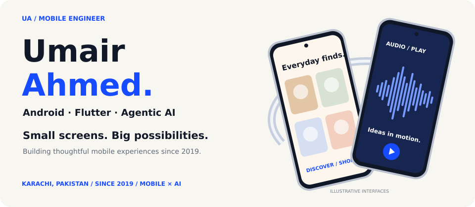
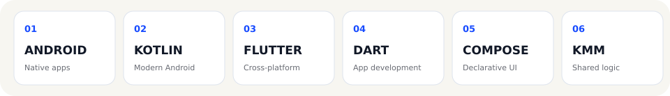
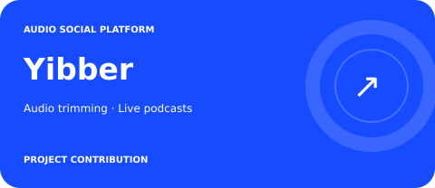
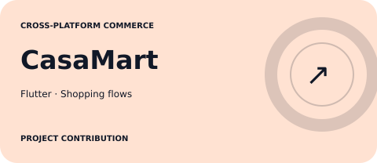
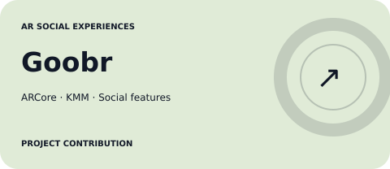
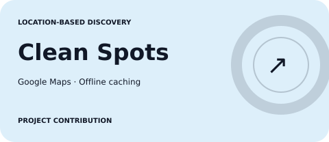

<!-- Upload this README, the assets folder and the resume to the root of your profile repository. -->

[**Work**](#selected-projects) &nbsp; / &nbsp; [**About**](#a-mobile-engineer-who-connects-product-and-code) &nbsp; / &nbsp; [**Expertise**](#good-experiences-solid-engineering) &nbsp; / &nbsp; [**Experience**](#the-journey)

**[umairahmed2k15@gmail.com](mailto:umairahmed2k15@gmail.com) &nbsp; · &nbsp; +92 335 321 8152**

## Selected projects

A selection of mobile products I’ve contributed to. Explore the engineering work below.

<table>
<tr>
<td width="50%"></td>
<td width="50%"></td>
</tr>
<tr>
<td width="50%"></td>
<td width="50%"></td>
</tr>
<tr>
<td width="50%"></td>
<td width="50%" align="center"><strong>Built with teams. Shipped for people.</strong>  Android · Flutter · AR · Audio · Maps  <a href="mailto:umairahmed2k15@gmail.com">Discuss a mobile project →</a></td>
</tr>
</table>

<strong>Yibber</strong> — Audio social platform · View project details

### Voice-first social experiences

Built audio trimming, sound-effect merging and live podcast features using ExoPlayer and Android AudioRecord APIs.

**Focus:** Audio processing, live and prerecorded podcasts, voice-first interactions.  
**Technologies:** Android · ExoPlayer · AudioRecord · Firebase

<strong>CasaMart</strong> — Cross-platform commerce · View project details

### Shopping from discovery to delivery

Built a cross-platform shopping application with product browsing, cart, checkout and order tracking flows using Flutter and Dart.

**Focus:** Shopping flows and application state management.  
**Technologies:** Flutter · Dart · Provider · Riverpod · BLoC

<strong>Goobr</strong> — Pet social experiences · View project details

### Social features with an AR layer

Implemented an AR filter pipeline using ARCore and custom shader rendering for pet social features. The project also included animated stickers, music posts and a KMM shared logic layer.

**Focus:** AR filters, social interactions and shared mobile logic.  
**Technologies:** Android · ARCore · Custom shaders · KMM

<strong>Curious</strong> — Anonymous social platform · View project details

### Privacy-focused social interactions

Contributed to an anonymity-first social application featuring encrypted chat, deep linking, geolocation, freemium functionality and social sign-in.

**Focus:** Messaging, location-aware features and authentication.  
**Technologies:** Android · Firebase Auth · Google Maps SDK

<strong>Clean Spots</strong> — Location-based discovery · View project details

### Discover places. Support community contributions.

Worked on a location-based spot finder with community features for adding, removing and reporting spots, plus offline caching through Room.

**Focus:** Map-based discovery, community contributions and offline data.  
**Technologies:** Android · Google Maps SDK · Room

## A mobile engineer who connects product and code

I build production applications across fintech, social and commerce. I collaborate with designers, backend engineers, QA and product teams to turn complex requirements into reliable mobile experiences.

My work spans native Android, Flutter, shared business logic with KMM, and practical AI tools for development teams. I care about maintainable architecture, testable code and interfaces that work well for the people using them.

- **Android & Flutter:** Native and cross-platform application development.
- **Clean Architecture:** Modular, maintainable and testable systems.
- **AI developer tools:** Claude-powered workflows for scaffolding, security checks and component generation.

## Good experiences. Solid engineering.

| Area | Technologies & practices |
| :--- | :--- |
| **Languages & mobile** | Kotlin, Java, Dart, Android, Jetpack Compose, Flutter, KMM |
| **Architecture** | Clean Architecture, MVVM, MVP, VIPER, Repository Pattern, Modular Architecture |
| **Flutter state management** | Provider, Riverpod, BLoC |
| **Data & networking** | Room, SQLite, Datastore, Realm, Retrofit, OkHttp, REST APIs, Firebase |
| **Async & dependency injection** | Coroutines, Flow, RxJava2, Dagger Hilt, Koin |
| **Testing & security** | JUnit, MockK, Espresso, SSL Pinning, Biometric Auth, Encrypted Storage |
| **AI & delivery** | Claude API, AI agents, GitHub Actions, Kover, JFrog Artifactory, Gradle |

## The journey

### Nymcard Payments
**Senior Software Engineer — Android** · Apr 2025 – Present

- Build payment features for cards, transactions and multi-currency wallets.
- Develop Claude-powered tools for scaffolding, security checks and UI generation.
- Share business logic with KMM and publish reusable internal libraries.

### Avanza Solutions
**Software Engineer — Android** · Jan 2023 – Apr 2025

- Developed Android features for financial applications.
- Implemented certificate pinning and encrypted local storage.
- Adopted Coroutines and Flow for asynchronous workflows.

### Cubix Inc.
**Software Engineer — Android** · Jun 2019 – Jan 2023

- Built audio, AR and social features across mobile products.
- Developed Flutter shopping flows for CasaMart.
- Applied Clean Architecture and unit and integration testing.

## Education

**BS Computer Science**  
Iqra University, Karachi · 2015 – 2019

**[Email](mailto:umairahmed2k15@gmail.com) · [LinkedIn](https://www.linkedin.com/in/umair-ahmed-028857119/) · [GitHub](https://github.com/UmairAhmed-Native) · [Resume](./Umair_Ahmed_Mobile_Engineer.pdf)**

**Umair Ahmed / Mobile Engineer**  
Karachi, Pakistan · Building since 2019

